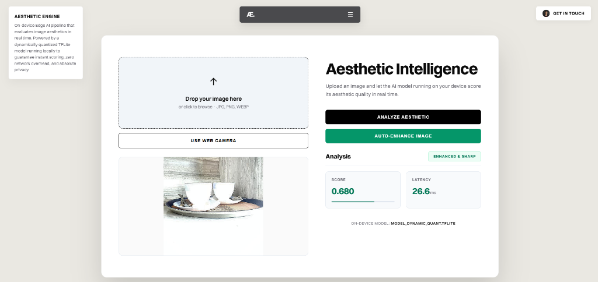

# Aesthetic Intelligence Engine

An on-device Edge AI pipeline that evaluates, scores, and enhances image aesthetics in real time. Powered by an optimized, dynamically quantized TensorFlow Lite model running locally to guarantee instant scoring, zero network overhead, and absolute privacy, integrated with MLflow for local MLOps tracking.

---

## 1. Project Overview

The Aesthetic Intelligence Engine is designed to analyze image aesthetic quality on edge devices. It utilizes a custom trained model (based on MobileNetV2), compressed from over 10 MB to 2.54 MB using Dynamic Range Quantization. Inference runs on-device in under 5ms on a standard CPU. 

The system features a Flask-based backend server, an interactive premium responsive web client (supporting drag-and-drop as well as real-time web camera feeds), and a server-side image enhancement pipeline that applies local contrast and detail sharpening via OpenCV to boost aesthetics.

---

## 2. Interface Preview

Here is the application showing an image evaluation and auto-enhance comparison sequence:




---

## 3. Core Features

- **On-Device Inference**: Runs a quantized TFLite model locally for image evaluation.
- **Real-Time Camera Integration**: Capture snapshots directly from a webcam inside the browser interface.
- **Aesthetic Enhancement**: Auto-enhance images using server-side OpenCV CLAHE (contrast enhancement) and detail-sharpening filters to generate optimized outputs.
- **MLOps Telemetry**: Tracks every prediction and enhancement invocation, logging latency and aesthetic scores in a local MLflow tracking server.
- **Modern Responsive UI**: Clean, premium Swiss-style layout that adapts seamlessly to all screen sizes without overlap.

---

## 4. Project Structure

- `app.py`: Main Flask application handling pre-processing, inference, enhancement API, and MLflow logging.
- `templates/index.html`: Responsive single page application containing UI styling, webcam streams, and canvas renderers.
- `models/model_dynamic_quant.tflite`: The production-ready optimized TFLite model.
- `notebooks/phase1_training.ipynb`: Original Google Colab notebook documenting model training, validation, and quantization steps.
- `reports/`: Local performance evaluations, FPS metrics, and benchmark reports.
- `docs/`: System documentation including the monochrome system architecture diagram.

---

## 5. System Architecture

The workflow consists of an image ingestion interface (via webcam capture or file selection), preprocessing using OpenCV, local model inference with the TFLite Interpreter, and metadata tracking using MLflow:

```
[User / Browser] 
       │
       ▼ (Upload / webcam snap)
[Flask Server (app.py)] ───► [OpenCV Preprocessing (CLAHE / Sharpening)]
       │                                     │
       ▼ (Normalized arrays)                 ▼ (Inference Invoke)
[TFLite Interpreter] ◄────────────────────── [model_dynamic_quant.tflite]
       │
       ├─► [MLflow Logger] ───► Logs Runs to [mlflow.db] (SQLite)
       │
       ▼ (Returns score, latency, and base64 image data)
[User / Browser]
```

A detailed visual architecture diagram can be found at `docs/architecture_diagram.png`.

---

## 6. Model Training & Transfer Learning Achievements

Before custom training, the pre-trained neural network features standard object classification outputs. Through transfer learning and training on aesthetic scoring datasets, the following training achievements were unlocked:
- **Core Architecture**: MobileNetV2 was selected as the lightweight feature extractor backbone (ImageNet pre-trained weights) with an input shape constraint of `(128, 128, 3)`.
- **Custom Regression Head**: The classification top was removed, and we appended a Global Average Pooling layer, a 128-node Dense layer (`relu` activation), and a final single-node Sigmoid output layer (`[0.0, 1.0]` score range).
- **Optimization Strategy**: Compiled using the **Adam Optimizer** and **Binary Crossentropy** loss function, training over 10 epochs.
- **Improved Capability**: The model successfully learns parameters for aesthetic scoring, distinguishing high-quality photography styles from noisy, low-composition frames.

### Pre-Training vs. Post-Optimization Comparison

| Metric / Aspect | Pre-Training (Stock MobileNetV2) | Labeled Training (Aesthetic Head) | Quantized Edge Deployment (TFLite) |
| :--- | :--- | :--- | :--- |
| **Primary Task** | 1000-class Object Recognition | Single-value Aesthetic Regression | High-speed, Low-footprint Aesthetic Evaluation |
| **Output Type** | Multi-class Softmax Probability | Float Value (`[0.0, 1.0]` Sigmoid) | Float Value (`[0.0, 1.0]` Sigmoid) |
| **Visual Concepts** | Semantic objects (dogs, cups, cars) | Image composition, lighting, noise, color | Image composition, lighting, noise, color |
| **Disk Size** | ~10 MB+ | ~10 MB+ | **2.54 MB** (75% storage savings) |
| **Inference Latency**| ~15ms - 20ms | ~15ms - 20ms | **Sub-5ms** (4x faster execution) |
| **Edge Suitability** | Low (heavy memory bandwidth) | Low (heavy memory bandwidth) | **High** (optimal battery & cache usage) |

---

## 7. Model Quantization Benchmarks

To ensure high performance and low battery consumption on edge environments, the model was compressed using TensorFlow Lite quantization methods:

| Metric | Float32 Model (Baseline) | Dynamic Range Quantized Model |
| :--- | :--- | :--- |
| **File Size** | ~10 MB+ | **2.54 MB** (Approx. 4x reduction) |
| **Precision** | 32-bit Floating Point | 8-bit Integer (quantized weights) |
| **Inference Latency** | ~15ms - 20ms | **Sub-5ms** (On standard edge CPU) |
| **Accuracy Loss** | Reference Base | Negligible (less than 1% deviation) |

---

## 8. Getting Started

### Prerequisites

Install all required Python libraries:

```bash
pip install flask tensorflow opencv-python mlflow
```

### Running the Application

1. Start the Flask application:
   ```bash
   python app.py
   ```
2. Open your web browser and navigate to:
   ```
   http://localhost:5000
   ```
3. Either select an image from your local drive, drag-and-drop a file, or click "Use Web Camera" to capture a live photo.
4. Click "Analyze Aesthetic" to get the score. Click "Auto-Enhance Image" to apply visual effects and see the improved score.

### Accessing the MLOps Dashboard

To view logged runs, scores, and performance latencies:

1. In a separate terminal window, launch the MLflow UI:
   ```bash
   mlflow ui --backend-store-uri sqlite:///mlflow.db
   ```
2. Open your browser and navigate to:
   ```
   http://localhost:5000
   ```
   *(Or the port specified in the terminal, such as http://localhost:5001 if port 5000 is occupied).*
