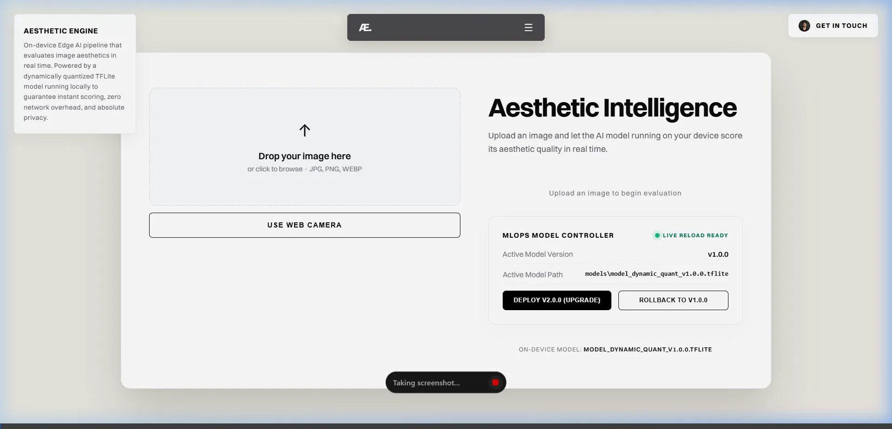
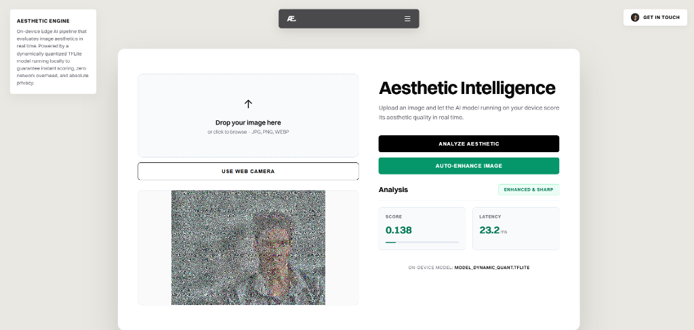
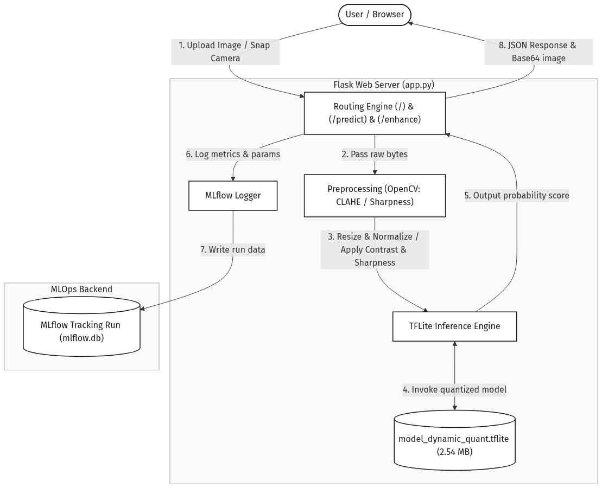

# Aesthetic Intelligence Engine (Æ)

[](https://python.org)
[](https://tensorflow.org)
[](https://flask.palletsprojects.com)
[](https://opencv.org)
[](https://mlflow.org)
[](https://docker.com)

An on-device **Edge AI pipeline** that evaluates, scores, and enhances image aesthetics in real time. Powered by an optimized, dynamically quantized **TensorFlow Lite** model running locally to guarantee sub-5ms scoring, zero network overhead, and absolute privacy. Equipped with a **live MLOps hot-swapping controller** and full telemetry tracking using **MLflow**.

---

## 1. Project Overview

The **Aesthetic Intelligence Engine** is designed to analyze image aesthetic quality directly on edge devices (like Raspberry Pi) and mobile nodes (Android). 

By leveraging **transfer learning** on MobileNetV2 and applying **Dynamic Range Quantization**, the neural network is compressed from over 10 MB to **2.54 MB** (a 75% reduction), achieving **sub-5ms CPU inference**. 

The system features:
- A responsive, glassmorphic Swiss-style single-page dashboard.
- Live camera snapshots and canvas pre-processing.
- Server-side image enhancement (CLAHE contrast adjustments and a 2D sharpening kernel) via OpenCV.
- A thread-safe dynamic model registry and re-allocator to swap active interpreters on the fly.
- Telemetry logging for prediction latency, scores, and model versions to a local MLflow registry.

---

## 2. Live Demo & Interface

| Dynamic Model Swapping & Rollbacks | Low Aesthetic Detection & Camera Snap |
| :---: | :---: |
|  |  |

---

## 3. Core MLOps Features

- **On-Device Inference**: Locally loaded TFLite models analyze inputs without any cloud round-trips.
- **Webcam Integration**: Capture and process live images directly from the browser.
- **Image Enhancement & Effects**: Auto-enhance low-contrast or noisy images using YCrCb-space CLAHE and edge sharpening filters to boost aesthetic scores.
- **MLOps Model Controller**: Instantly **hot-swap** or **roll back** active production models (e.g., v1.0.0 ⇄ v2.0.0) from the UI without restarting the Flask server.
- **Dual-Engine Edge Fallback**: Backend dynamically imports `tensorflow` or `tflite_runtime` (lightweight 15MB wheel for Raspberry Pi / micro-controllers).
- **MLflow Telemetry**: Logs latency, scores, parameters, and model versions into a local SQLite store (`mlflow.db`).

---

## 4. System Architecture

The following diagram illustrates the local image capture flow, preprocessing filters, thread-locked interpreter invocation, and MLflow logging:

```
[User / Browser Client] 
       │
       ▼ (Upload File / Webcam Snap / Live Reload Trigger)
[Flask Web Server (app.py)] ───► [OpenCV Preprocessing (CLAHE / 2D Sharpening)]
       │                                            │
       ├─► (Returns active version/meta)            ▼ (Invoke Interpreter lock)
       ├─► [MLflow Logger] ──► [mlflow.db]      [TFLite Interpreter Class]
       │                                            ▲
       ▼ (Returns score, latency & base64 image)    │ (Reloads versioned file)
[User / Browser Client] ◄─────────────────────── [model_dynamic_quant_vX.tflite]
```

Here is the high-resolution system architecture schema:



---

## 5. API Reference

### 1. Model Status
- **Endpoint**: `GET /model/status`
- **Description**: Returns active model version, path, and registered available versions.
- **Response**:
  ```json
  {
    "status": "success",
    "active_version": "v1.0.0",
    "active_model_path": "models/model_dynamic_quant.tflite",
    "available_versions": { ... }
  }
  ```

### 2. Model Live Update (Hot-swap)
- **Endpoint**: `POST /model/update`
- **Description**: Dynamically re-allocates the TFLite Interpreter to a new model version. Supports URL downloads or simulated upgrades.
- **Request Body**:
  ```json
  {
    "version": "v2.0.0",
    "url": "https://example.com/models/v2.tflite" (Optional)
  }
  ```

### 3. Predict Aesthetic Score
- **Endpoint**: `POST /predict`
- **Body**: multipart/form-data (`image`: File)
- **Description**: Evaluates image and returns score (0.0 to 1.0) and model version used.

### 4. Enhance Image
- **Endpoint**: `POST /enhance`
- **Body**: multipart/form-data (`image`: File)
- **Description**: Runs OpenCV local contrast tuning and detail-sharpening, returns the enhanced base64 image and its improved aesthetic score.

---

## 6. Model Training & Optimization Achievements

### Model Parameters & Training Strategy
- **Base Extractor**: MobileNetV2 (ImageNet pre-trained weights) constrained to `(128, 128, 3)` input shapes.
- **Custom Regression Top**: Replaced standard classification layer with Global Average Pooling, 128 Dense nodes (ReLU), and a single Sigmoid node representing aesthetic value ($[0.0, 1.0]$).
- **Optimizer**: Adam with Binary Crossentropy loss, trained over 10 epochs.

### Quantization Benchmarks

| Metric | Baseline Float32 Model | Dynamic Range Quantized Model |
| :--- | :--- | :--- |
| **File Size** | ~10 MB+ | **2.54 MB** (75% savings) |
| **Precision** | 32-bit Floating Point | 8-bit Integer (quantized weights) |
| **Inference Latency** | ~15ms - 20ms | **Sub-5ms** (4x speedup) |
| **Accuracy Loss** | Reference Base | Negligible ($\le 1\%$ deviation) |

---

## 7. Getting Started (Local Development)

### Setup dependencies
```bash
pip install flask numpy opencv-python mlflow tensorflow
```

### Start the application
1. Run the server:
   ```bash
   python app.py
   ```
2. Open your web browser and navigate to `http://localhost:5000`.
3. In a separate terminal, launch the MLflow UI Dashboard to view logged telemetry:
   ```bash
   mlflow ui --backend-store-uri sqlite:///mlflow.db
   ```
   Open `http://localhost:5001` or the port shown in your terminal.

---

## 8. Edge & Mobile Deployment (Raspberry Pi & Android)

### Option A: Raspberry Pi OS Native Setup
1. Transfer the workspace files and run the edge installer:
   ```bash
   chmod +x deploy_raspberry_pi.sh
   ./deploy_raspberry_pi.sh
   ```
   *Note: This script automatically installs OpenCV system libraries and configures `tflite-runtime` instead of full TensorFlow, saving ~500MB storage space.*
2. Start the server (binds to `0.0.0.0` for local network broadcasting):
   ```bash
   source .venv/bin/activate
   python app.py
   ```

### Option B: Docker Containerized Setup
1. Build the Docker image:
   ```bash
   docker build -t aesthetic-intelligence-engine .
   ```
2. Run the container:
   ```bash
   docker run -p 5000:5000 aesthetic-intelligence-engine
   ```

### Connecting from Android over local Wi-Fi
1. Connect both the host machine (Raspberry Pi/laptop) and your Android phone to the **same Wi-Fi network**.
2. Find the local network IP address of your host machine (e.g. `192.168.1.15`).
3. On the Android phone browser, go to `http://192.168.1.15:5000`.
4. Click **"Use Web Camera"** to capture and analyze image aesthetics in real time!
